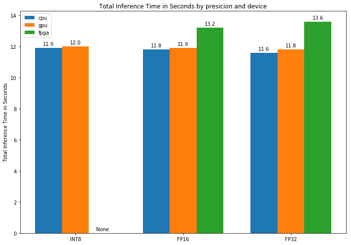
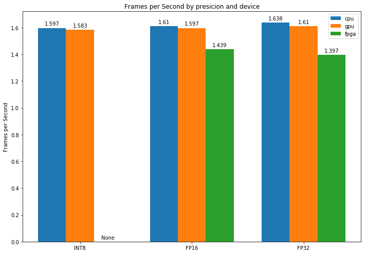
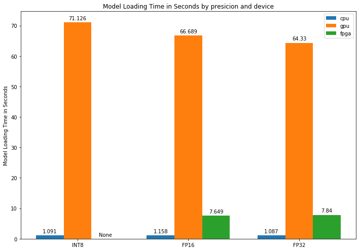

# Computer Pointer Controller

**Computer Pointer Controller is a python application to control the mouse pointer with your eyes using machine learning.** It's using the [Gaze Estimation model](https://docs.openvinotoolkit.org/latest/_models_intel_gaze_estimation_adas_0002_description_gaze_estimation_adas_0002.html) to estimate the gaze of the user's eyes and change the mouse pointer position accordingly

## Project Set Up and Installation
### Prerequisites
This project requires OpenVINO™ toolkit to optimize and run machine learning models.

Follow [the documentation](https://docs.openvinotoolkit.org/latest/index.html) for OpenVINO™ toolkit here.

The pre-trained models for OpenVINO™ toolkit is on the project root directory.

Install all the required Python modules on the project root directory.
```
pip install -r requirements.txt
```

## Demo
Try running on demo.mp4 on the project src directory.
```
python main.py
```

After finishing the inference, you can check output video named `out.mp4` on the root directory.

## Documentation
### The command line options
All arguments are optional.

| Argument          | Description                                | Default         |
|-------------------|--------------------------------------------|-----------------|
| -p / --input_path | The location of the input file             | ../bin/demo.mp4 |
| -t / --input_type | Type of input, any of cam, video and image | video           |
| -d / --device     | The device name                            | CPU             |
| -b                | Draw bounding boxes                        | False           |
| -g                | Draw gaze lines                            | False           |

## Benchmarks
### Total Inference Time in Seconds


### Frames per Second


### Model Loading Time in Seconds


## Results
The benchmark runs on four different hardware types, CPU, GPU, (VPU), and FPGA with three precisions, FP32, FP16, and INT8.

| Hardware Type | Device                                |
|---------------|---------------------------------------|
| CPU           | Intel Core™ i5-6500TE processor       |
| GPU           | Intel® HD Graphics 530 integrated GPU |
| (VPU)           | Intel Neural Compute Stick 2          |
| FPGA          | IEI Mustang-F100-A10 FPGA card        |

This benchmark uses [IEI Tank* 870-Q170](https://software.intel.com/en-us/iot/hardware/iei-tank-dev-kit-core) as an edge node and all devices will failback to Intel Core™ i5-6500TE CPU.

Overall, it can be seen that the longest inference time was with FPGA, while CPU and IGPU with CPU consistently accounted for the lowest on Total Inference Time in Seconds bar chart. On Frames per Second, all devices record low FPS including FPGA. The IGPU spent the most significant time on model loading.

In terms of FPGA, it spent around 13 seconds both on FP16 and FP32 precision for inference recording about 1.4 FPS. Although FPGAs can execute neural networks with high performance and little latency to run many sections of the FPGA in parallel, there are no enough frames (19 frames total on demo.mp4) so that it executes in parallel, because the application uses batch inputs.

On the model loading time of GPU, it recorded over 64 seconds comparing with others, about 1 second on CPU and about 8 seconds on FPGA. The OpenCL uses a just-in-time compiler. With an IGPU, this can lead to significantly longer model load times.

Finally, all three bar charts show that an increase of precision leads to little improvement in performance through almost all devices. It would be caused by the optimization of these devices. For example, on IGPUs, the Execution Unit instruction set is optimized for 16bit floating-point data types. This improves inference speed, as well with 32 bit operands.

## Notes
Please note The face-detection-adas-binary-0001 always use INT1 precision as it is only available on the precision. The VPU, Neural Compute Stick 2 only supports FP16 precision and also the FPGA doesn't support INT8 precision. So these devices are skipped. In addition, the landmarks-regression-retail-0009 and head-pose-estimation-adas-0001 are only available with FP16 and FP32 precision.

## Improvement

Currently, the performance benchmark was not done on VPU because it only supports FP16 precision. Unfortunately, the face-detection-adas-binary-0001 is available only INT1.

The face detection model with FP16 precision will enrich the above performance benchmark result.
